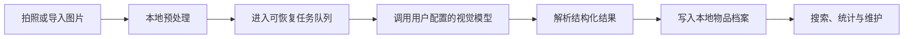

# 物见

<div align="center">
  <p><strong>把拍照、AI 识别与物品归档连成一条顺手的移动工作流。</strong></p>
  <p>
    <a href="https://flutter.dev/"></a>
    <a href="https://dart.dev/"></a>
    
    <a href="./LICENSE"></a>
  </p>
  <p>
    <a href="#快速开始">快速开始</a> ·
    <a href="#核心能力">核心能力</a> ·
    <a href="#技术架构">技术架构</a> ·
    <a href="./docs/releases/v1.0.4.md">v1.0.4 发布说明</a>
  </p>
</div>

> 当前版本：`1.0.4+5`。项目处于可运行、持续迭代阶段，Android 与 iOS 均由同一套 Flutter 代码维护。

## 产品预览

| 拍摄与任务队列 | 物品档案 | 模型设置 |
| --- | --- | --- |
|  |  |  |

## 为什么做物见

相册适合保存照片，却不擅长回答“这是什么、放在哪里、什么时候买的”。物见把一次拍摄拆成可恢复的后台任务，经由用户选择的 AI 服务提取物品信息，再落入可检索、可维护的本地档案。

它适合这些场景：

- 记录家中、工作室或仓库里的物品；
- 用图片快速建立结构化清单；
- 在网络或模型服务不稳定时保留任务，稍后继续处理；
- 自己选择兼容的 AI 服务，而不是绑定单一供应商。

## 核心能力

| 能力 | 当前实现 |
| --- | --- |
| 拍照与导入 | 相机拍摄、图片选择、预处理与本地保存 |
| AI 识别 | 支持多个预设服务商及 OpenAI-compatible 自定义端点 |
| 任务队列 | 可观察任务状态，支持失败恢复与网络保护 |
| 物品管理 | 结构化档案、分类、搜索与统计 |
| 本地数据 | 图片与业务数据保存在设备端 |
| 跨平台 | Android 与 iOS 共用 Flutter 工程 |

## 快速开始

### 环境要求

- Flutter SDK，版本需满足 `pubspec.yaml` 中的约束；
- Dart `^3.9.2`；
- Android Studio 或 Xcode；
- 一台模拟器或真机；
- 至少一个可用的视觉模型服务及其 API Key。

### 运行项目

```bash
git clone https://github.com/GreatAndyC/Wujian_Flutter.git
cd Wujian_Flutter
flutter pub get
flutter run
```

可先用以下命令确认开发环境：

```bash
flutter doctor
flutter devices
```

### 配置 AI 服务

启动应用后，在模型设置中选择预设服务商，或填写兼容 OpenAI API 规范的自定义端点。API Key 由应用在本地保存，不应写入源码、提交到 Git，或出现在截图和日志中。

不同服务商支持的模型、价格、限额和数据处理政策会变化，请以对应服务商的官方说明为准。

## 工作流程



任务队列是主流程的一部分：识别请求失败时，应用会保留可恢复状态，避免一次网络波动直接丢失整批采集工作。

## 技术架构

项目按职责拆分为界面、状态与领域服务、本地持久化、模型接入和平台能力：

```text
lib/
├── screens/       # 页面与交互流程
├── widgets/       # 可复用界面组件
├── providers/     # 状态管理与依赖协调
├── services/      # AI、任务、存储等业务服务
├── models/        # 领域数据结构
└── utils/         # 通用工具
```

具体目录会随迭代调整；以仓库当前源码为准。

## 数据与隐私

- 物品记录和原始图片以本地存储为主；
- 只有执行识别时，相关图片和请求内容才会发往用户选择的模型服务；
- 项目不会替第三方服务商承诺数据保留、训练用途或合规策略；
- 卸载应用可能同时删除本地数据，升级或重装前请自行备份重要内容；
- 发布构建不得包含真实 API Key、测试账号或调试日志中的敏感信息。

## 开发与验证

```bash
flutter analyze
flutter test
flutter build apk
```

提交前至少应完成静态检查和测试；涉及相机、相册、密钥存储、网络切换或后台恢复的改动，还需要在 Android 与 iOS 真机上验证。

## Android 签名提示

`v1.0.3` 的部分 Android 构建使用过不同的调试签名，可能无法直接覆盖安装新版本。遇到签名冲突时，需要先备份重要数据，再卸载旧版本并重新安装；卸载会清除应用的本地数据。

## 项目状态

当前开发重点包括：

- 提升长队列和异常网络下的稳定性；
- 完善图片存储、去重和空间统计；
- 继续收敛模型适配层与结构化输出；
- 增加关键本地数据流程的自动化测试。

完整版本变化见 [v1.0.4 发布说明](./docs/releases/v1.0.4.md)。

## 贡献

欢迎通过 Issue 描述可复现的问题或提出改进建议。提交代码前，请确保改动范围清晰，并附上相应的测试或人工验证说明。

## 许可证

本项目使用 [MIT License](./LICENSE)。
